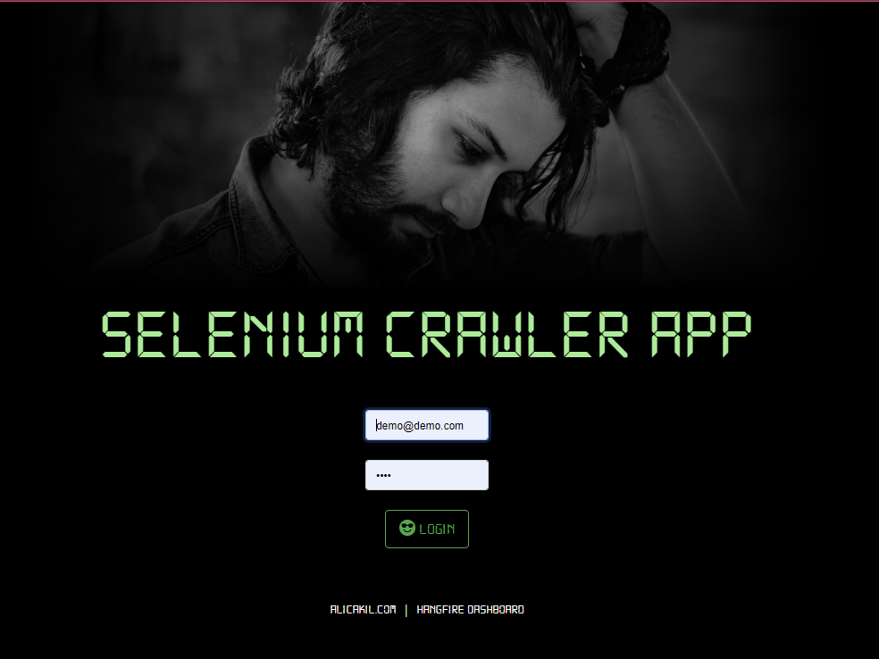
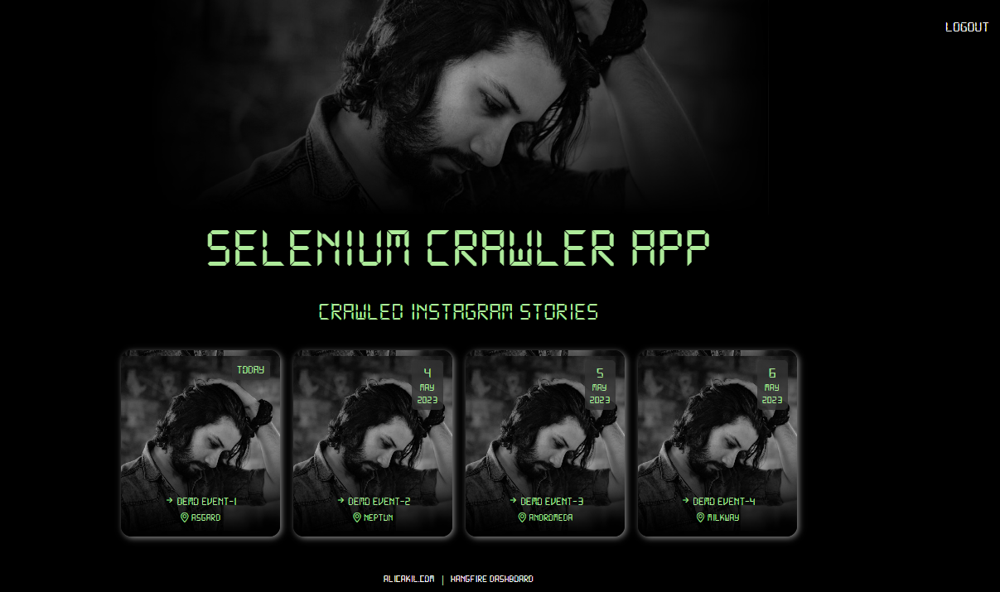

<h1 style="color:darkorange"> Selenium Crawler </h1> 

It is a crawler demo application for instagram using selenium that crawls user stories, downloads as image and uploads to AWS S3, And has a UI that shows crawled story images. It has a cron service (hangfire based) also to do crawling based on pre-defined reccurrence.

# Run
1. Go to Instagram.cs, CrawlWebSite method, and add instagram accounts you want to crawl there.
2. go to AppConstants.cs, Db.ConnectionString, replace it with yours
2. run the app, it should initialize db an dummy data on first run
3. login; email: `demo@demo.com`  password: `demo`
4. Run instagram crawler from hangfire dashboard

# Description 

- SOLID or other common principles are not implemented very well, such as injection etc. because of a limited time, Can be better with refactoring for sure. Target is to show selenium basics.
- Webb app to be updated 
- hangfire to be prepared 
- screen-shot to be added to read me refactor readme (getting started, run, purpose of app etc.)

# UI looks like

# To add migration
- `dotnet ef migrations add --project ./Dashboard/  Initial_Migration`

# To update database
- `dotnet ef database update --project ./Dashboard/`

# To remove last migration
To remove last migration; (dont forget to update database before this (will run down() for local): 
- `dotnet ef migrations remove --project ./Dashboard/ -f`